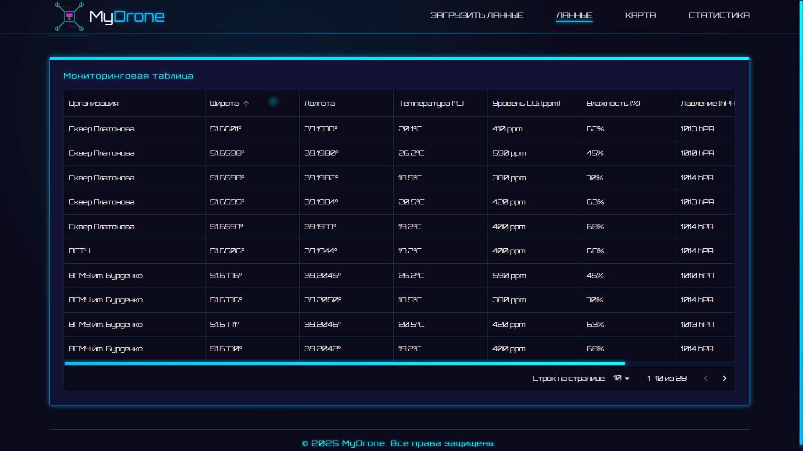
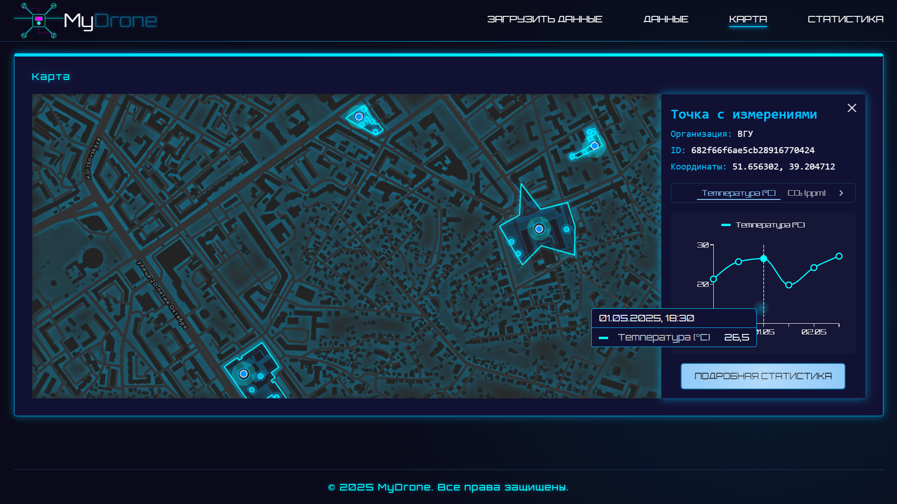
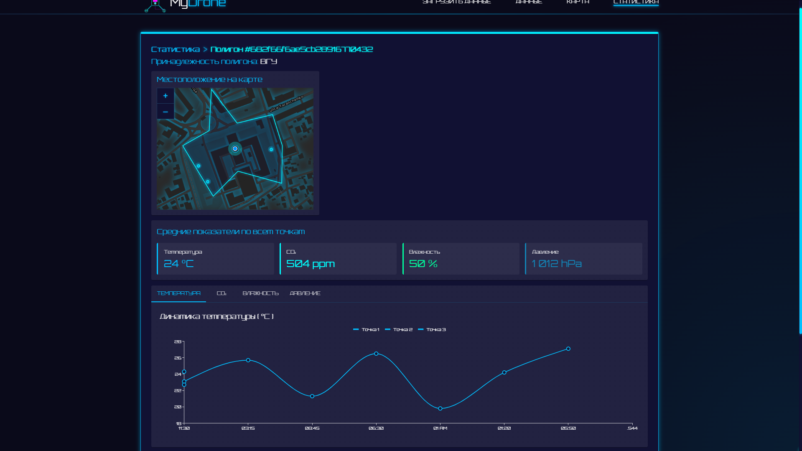
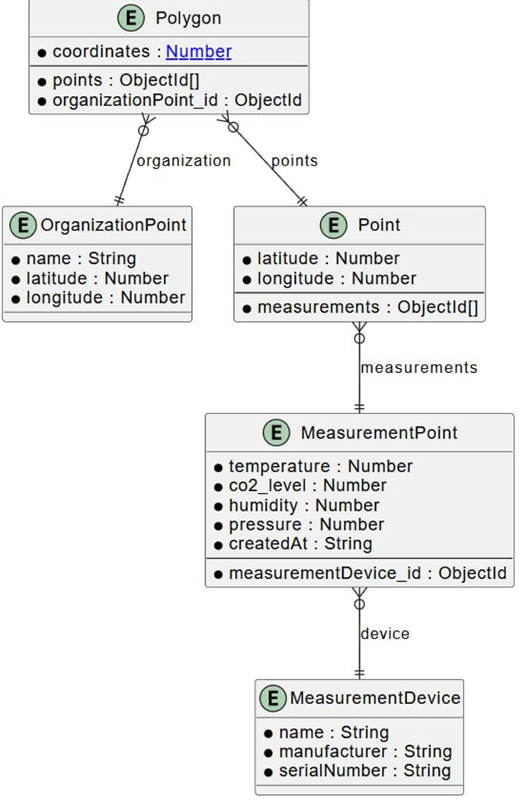
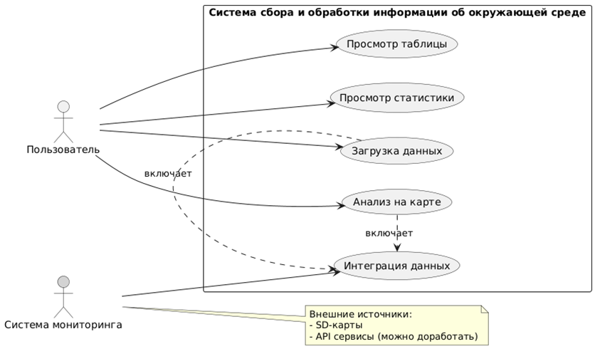
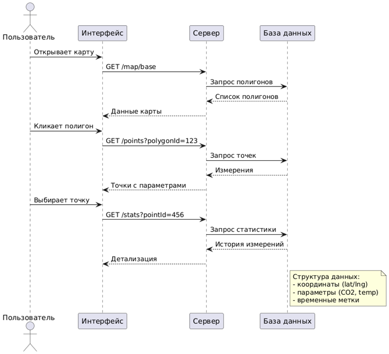

# Система сбора и обработки информации об окружающей среде

Проект для **мониторинга** и **анализа** экологической информации с помощью **дронов**.

## 📖 Цели проекта

Основные цели:

- Автоматизация сбора данных импорт экологических измерений с SD-карт в формате JSON;
- Наглядное представление данных автоматическое формирование таблиц с возможностью сортировки и фильтрации;
- Визуализация данных на интерактивной карте с геопривязкой;
- Отображение временной динамики через графики и диаграммы.

## 📸 Интерфейс

### Главная страница

### Таблица

### Карта

### Статистика

## 🛠️ Технологии

### Frontend

- **React 19** + **Vite**
- **MUI (Material UI)**
- **OpenLayers**
- **Axios**
- **Day.js / Lodash**

### Backend

- **Node.js**
- **Express**
- **MongoDB** + **Mongoose**
- **Multer**

## 🗂️ Диаграммы

### Диаграмма классов

### Диаграмма вариантов использования

### Диаграмма последовательностей

